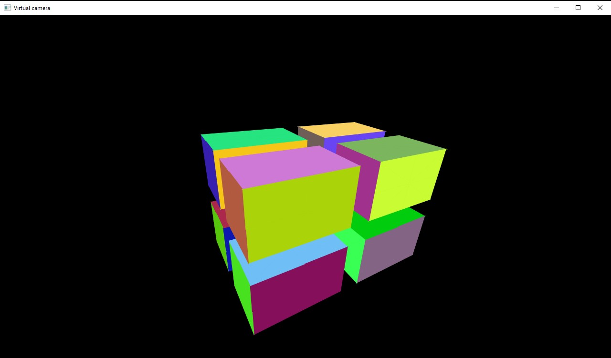
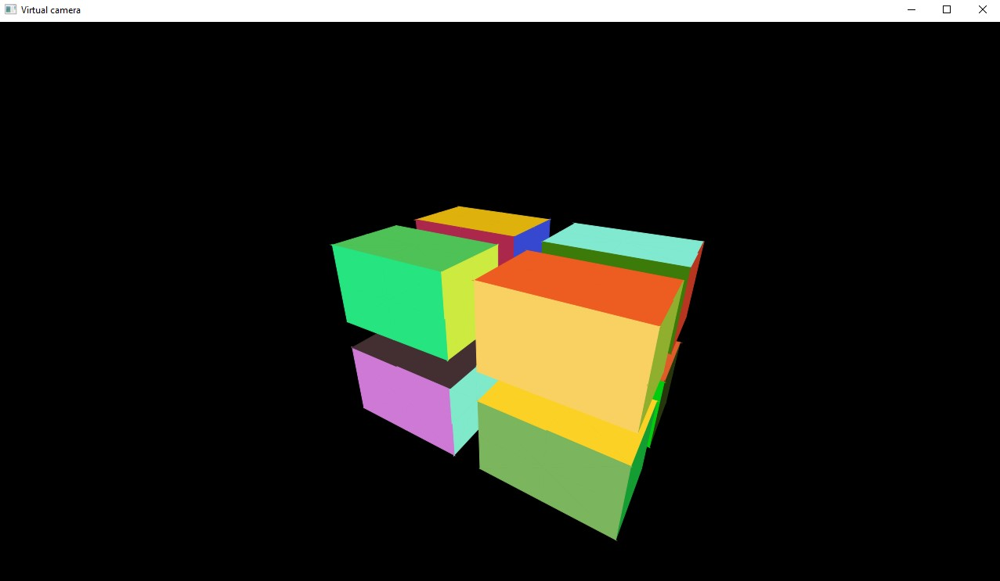
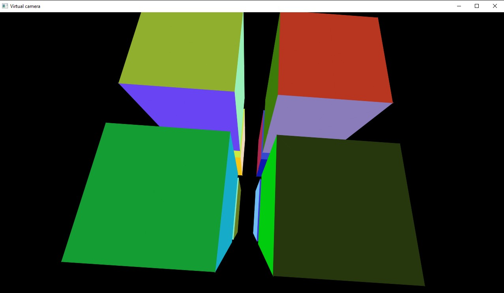

# VirtualCamera
Virtual perspective camera for computer graphics classes.
Stack: Java with JavaFX framework

Covering of hidden edges is done with painter's algorithm
based on distance from center of a triangle to camera position.
At the beginning every wall is being recursively split into a bunch
of triangles, which are later transformed according to camera movement.
For better efficiency only walls directed towards observer are being processed
in drawing phrase.

IMPORTANT:

If you want to run this project you need to link JavaFX modules in JVM options
--module-path "Your path to JavaFX" --add-modules "javafx.base,javafx.graphics,javafx.controls,javafx.fxml"

Results:

